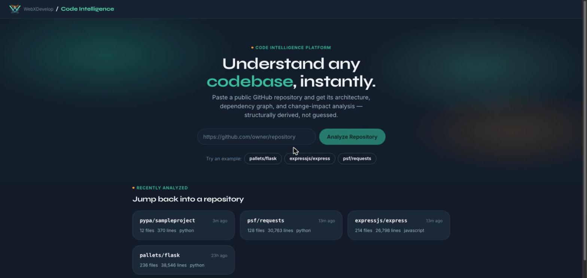
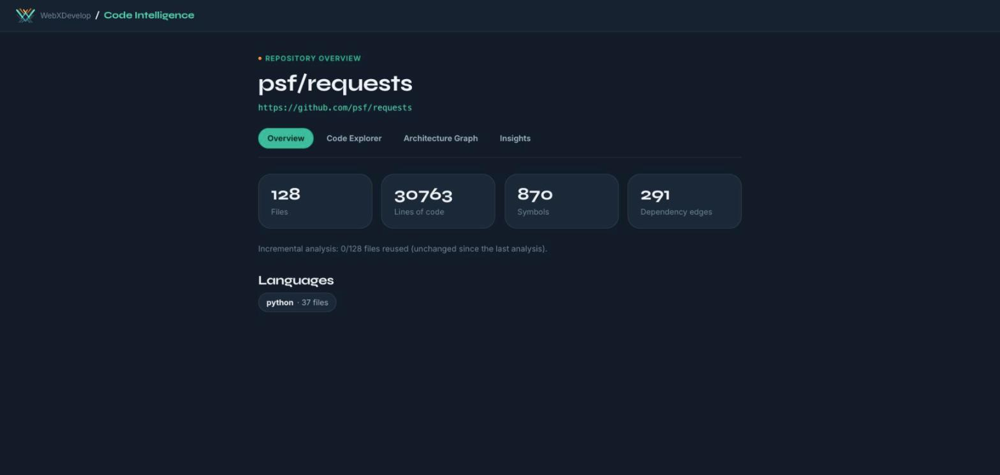
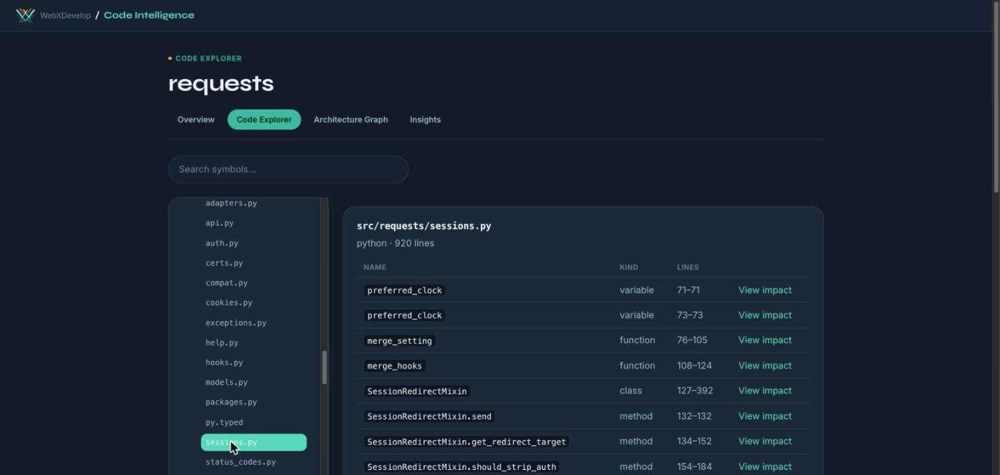
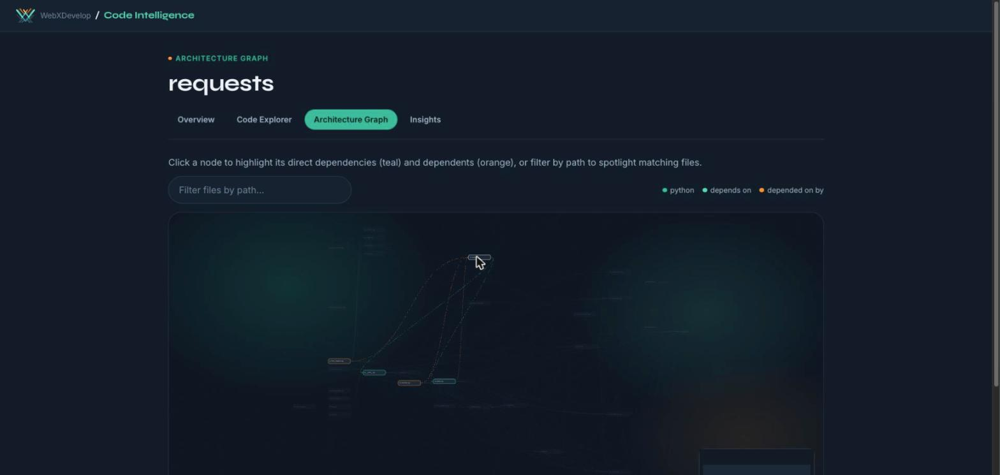
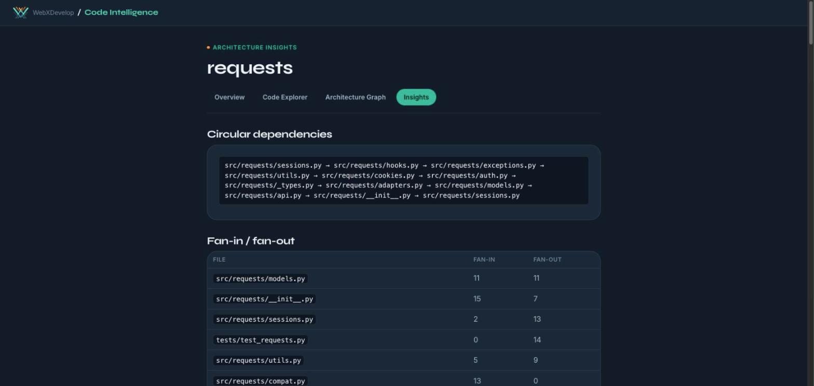
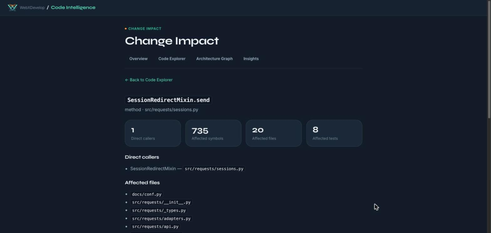

# Code Intelligence Platform

Analyzes public Git repositories and builds a structured, queryable representation of their codebase — architecture, dependencies, symbols, and change impact. Paste a GitHub URL, get a real, interactive map of the codebase: dependency graph, symbol index (down to methods), circular-dependency and fan-in/out analysis, and change-impact analysis for any function or class.

> **Status:** feature-complete for its stated scope. Repo ingestion, language detection, AST/tree-sitter symbol extraction (including nested methods), a module-level dependency graph (ES modules **and** CommonJS `require()`), a same-file + import-resolved call graph (including `self`/`this` method calls), circular-dependency detection, architecture insights, change-impact analysis, and content-hash-based incremental re-analysis — all persisted and queryable through GraphQL, with a full React UI (repository history, live job progress, Code Explorer, an interactive Architecture Graph, Architecture Insights, and Impact Analysis), a WebXDevelop-branded design system, a real performance benchmark suite, Playwright E2E coverage of the critical user flow, and GitHub Actions CI. No Docker/Redis anywhere in the stack (see "Background jobs without a queue" below) — it runs on plain Node + Python + PostgreSQL, matching the target shared-hosting deployment. There is no AI/LLM layer in this project by design.

## Screenshots

| | |
|---|---|
| **Landing page** — analyze a repo, jump back into a recent one | **Repository Overview** — stats at a glance |
|  |  |
| **Code Explorer** — file tree, symbol search, nested methods | **Architecture Graph** — click a node to trace dependencies/dependents |
|  |  |
| **Architecture Insights** — circular dependencies, fan-in/out | **Impact Analysis** — blast radius of changing one symbol |
|  |  |

## Live demo

Not yet deployed. The "Deploying to Plesk" section below documents the target deployment; once a live instance exists, its URL goes here.

## Key features

- **Paste a GitHub URL, get a real analysis** — no auth, no setup, a public repo is all it takes.
- **Repository history** — every analyzed repository is listed on the landing page, ordered by most recent activity; click one to jump straight back into its dashboard without re-analyzing.
- **Live job progress** — the UI polls the running job and shows which pipeline stage it's in (cloning → parsing → resolving imports → building call graph → persisting), with a graceful failure state (e.g. repo not found, clone timeout) instead of a dead end.
- **Code Explorer** — a real file tree plus a per-file symbol table and a debounced cross-file symbol search, both aware of nested methods (`ClassName.method`).
- **Architecture Graph** — an interactive, dagre-laid-out dependency graph: click a node to highlight its direct dependencies (teal) and dependents (orange), filter by path to spotlight matching files, a language-colored legend, a minimap, and pan/zoom controls. Large repos are automatically capped to the most-connected files so the graph stays readable and fast.
- **Architecture Insights** — circular-dependency detection (iterative Tarjan's SCC), fan-in/fan-out ranking, and large-file/isolated-file call-outs, computed over the real persisted graph.
- **Change-Impact Analysis** — for any function, class, or method: direct callers, the transitive set of affected files/symbols, affected tests, and plain-language risk indicators (e.g. "no test coverage found").
- **Incremental re-analysis** — re-analyzing a previously-seen repository reuses unchanged files' parse/extraction results via content hashing, with no staleness risk (see below) and no new UI — it's the same mutation, just faster.
- **WebXDevelop-branded UI** — a dark, two-accent (teal/orange) design system built from the actual WebXDevelop brand (logo, palette, typography) rather than a generic template, aiming for the polish level of tools like Linear, Vercel, or Sentry.

## Architecture

```
React / TypeScript / Vite  →  Python / FastAPI / GraphQL  →  PostgreSQL
```

No Docker, no Redis, no message broker. The target production environment is shared Plesk hosting, which doesn't support custom daemons or containers, so the architecture is deliberately plain: a Python web process and a Postgres database, nothing else required to run it. See "Background jobs" below for how analysis work still happens off the request path without a queue.

The Python analysis engine (`analysis-engine/`) is the deterministic source of truth. It parses source with real ASTs (`tree-sitter` for TS/JS, the stdlib `ast` module for Python), extracts symbols (functions/classes/variables/interfaces/type-aliases, and one level of nesting — methods inside classes) and import/export edges (ES `import`/`export` **and** CommonJS `require()`), and resolves those edges into a module-level dependency graph — it can answer structural questions like "what does this module depend on" entirely on its own, with no database and no LLM involved. The backend persists what the engine produces. There is no AI/LLM layer anywhere in this stack.

```
Repository URL
      │
      ▼
GraphQL mutation (backend) ──creates──▶ analysis_jobs row (pending)
                                                │
                                                ▼
                                   BackgroundTasks.add_task
                                   (same process, after the response is sent)
                                                │
                                                ▼
                              claim (atomic UPDATE, see jobs/claims.py)
                                                │
                         ┌──────────────────────┼───────────────────────┐
                         │                      │                       │
                 normal in-process      app startup reconciles   cron sweep script
                 request path           any stuck pending/        (jobs/sweep.py) re-claims
                                         stale-running job         anything still stuck
                         │                      │                       │
                         └──────────────────────┴───────────────────────┘
                                                ▼
                              analysis-engine (no DB access):
                              clone → detect languages → parse → extract symbols/imports → resolve graph
                                                │
                                                ▼
                    persists Analysis + File + Symbol + DependencyEdge rows, job → completed/failed
```

### Background jobs without a queue

Shared Plesk hosting runs Python apps under Passenger, which can recycle the web process between requests — so a plain in-memory background task isn't *guaranteed* to run to completion. Three things work together instead of a Redis/Celery-style queue:

1. **In-process task** (`backend/src/backend/jobs/tasks.py::run_analysis_job`) — the `analyzeRepository` mutation schedules it via FastAPI's `BackgroundTasks`, so it runs in the same process right after the response is sent. This is the fast path for the overwhelming majority of requests.
2. **Startup reconciliation** (`main.py`'s `lifespan`) — on every process start, re-claims any job still `pending` or stuck `running` past the staleness threshold, so a process recycle mid-job just delays it rather than losing it.
3. **Cron sweep** (`backend/src/backend/jobs/sweep.py`) — a standalone script, meant to be invoked periodically by Plesk's Scheduled Tasks, that does the same reconciliation independently of the web process's lifecycle. Backstops the (unlikely but possible) case where no web request restarts the process for a while.

All three funnel through one atomic claim (`backend/src/backend/jobs/claims.py`): `UPDATE analysis_jobs SET status='running', started_at=now() WHERE status='pending' OR (status='running' AND started_at < now() - staleness_threshold) RETURNING id`. Postgres row-level locking makes this safe against two of these three paths firing at the same moment — the loser's `WHERE` no longer matches the row the winner just updated.

This also means Docker/a real queue can be introduced later without a rewrite: `run_analysis_job`/`execute_claimed_job` are plain async functions with no framework coupling — wrapping one in an arq/Celery task body later is a small, additive change, not a redesign.

### Incremental analysis

Re-analyzing a repository that's been seen before is transparent and automatic — same `analyzeRepository` mutation, no new UI. The diffing strategy is **content-hash comparison, not git-commit diffing**: repositories are shallow-cloned (`git clone --depth 1`), so a true `git diff <old-sha> <new-sha>` isn't available without fetching more history, which would add clone time/complexity for a diff that hashing already gives for free.

Each `File` row caches a `content_hash` (sha256) **and its raw extracted `imports`/`calls`** (`raw_imports`/`raw_calls` JSON columns — not just the resolved edges), plus the `extractor_version` that produced them. On the next analysis, a file whose hash **and** extractor version both match is reused verbatim, skipping `ast.parse`/tree-sitter-parse and extraction entirely. The extractor-version check matters: it's what stops an *engine upgrade* (e.g. the nested-method extraction added in this project) from silently continuing to serve pre-upgrade extraction results for a repository that hasn't actually changed — a real staleness bug that content-hashing alone can't catch, since the file's bytes genuinely didn't change, only the logic that reads them did. Resolution (`resolve_relationships`/`resolve_calls`) always re-runs over the **full current file set** regardless of what was reused, so a changed file's import can newly resolve to an unchanged file, and an unchanged file's previously-resolved import correctly becomes unresolved if its target was deleted elsewhere.

That last point matters: an earlier design considered just carrying forward each unchanged file's *previously-resolved* edges directly, skipping resolution entirely for those files — which is simpler but has a real bug (a dangling edge pointing at a file deleted elsewhere in the repo, while the file that referenced it stayed byte-identical). Caching the raw imports/calls and always re-running resolution costs a small amount of extra JSON storage per file, in exchange for **no staleness limitation at all** — every analysis, incremental or not, produces exactly the graph a full analysis would, just computed partly from cache. See `analysis_engine/pipeline.py::analyze_workspace` and `backend/src/backend/jobs/incremental.py`.

`Analysis.commitSha` is also populated (`git rev-parse HEAD` right after clone) — purely informational, never load-bearing for the diffing itself.

## Tech stack

| Layer | Technology |
|---|---|
| Frontend | React 19, TypeScript, Vite, React Router, `urql` (GraphQL client), `@xyflow/react` + `@dagrejs/dagre` (Architecture Graph) |
| Backend | FastAPI, Strawberry GraphQL, SQLAlchemy 2.0 (async) + Alembic, Pydantic Settings |
| Analysis engine | Pure Python; `ast` (stdlib) for Python, `tree-sitter` + `tree-sitter-javascript`/`tree-sitter-typescript` for TS/JS/JSX/TSX |
| Database | PostgreSQL |
| Testing | `pytest` (backend + analysis-engine, against a real local Postgres), Playwright (E2E) |
| CI | GitHub Actions |
| Package management | `uv` (Python workspace: `backend` + `analysis-engine`), `pnpm` (frontend) |

No Docker, no Redis, no message broker — see "Architecture" above for why.

## Local development

Requires Node.js, a Python toolchain with [uv](https://docs.astral.sh/uv/), and a local PostgreSQL server — no Docker.

```bash
# 1. Frontend dependencies
cd frontend && pnpm install && cd ..

# 2. Python dependencies (uv workspace covers backend + analysis-engine)
uv sync

# 3. Environment variables
cp .env.example .env   # edit DATABASE_URL if your local Postgres differs

# 4. Start Postgres and create the database (macOS/Homebrew shown; adjust for your OS)
brew install postgresql@16   # if not already installed
brew services start postgresql@16
psql postgres -c "CREATE USER cip WITH PASSWORD 'cip_dev_password' CREATEDB;"
createdb -O cip cip

# 5. Run database migrations
cd backend && uv run alembic upgrade head && cd ..

# 6. Start the backend
cd backend && uv run uvicorn backend.main:app --reload --port 8000 && cd ..

# 7. Start the frontend (separate terminal)
cd frontend && pnpm dev
```

- Frontend: http://localhost:5173
- Backend REST health check: http://localhost:8000/health
- Backend GraphQL: http://localhost:8000/graphql

Try it: paste `https://github.com/pypa/sampleproject` (or click one of the example chips) into the landing page and click "Analyze Repository" — the page polls job status and automatically navigates to the Repository Overview once analysis completes, from which the Code Explorer, Architecture Graph, Architecture Insights, and (via any symbol's "View impact" link) Impact Analysis are all reachable from the same tab bar. Previously analyzed repositories reappear on the landing page under "Recently analyzed." Or run the mutation directly:

```bash
curl -s -X POST http://localhost:8000/graphql -H "Content-Type: application/json" \
  -d '{"query":"mutation($url: String!) { analyzeRepository(repoUrl: $url) { id status } }","variables":{"url":"https://github.com/pypa/sampleproject"}}'
```

Poll the job (or just check Postgres) until `status` is `completed` — no worker process to start, the backend alone will finish it:

```bash
psql -U cip -d cip -h localhost -c "select status from analysis_jobs order by created_at desc limit 1;"
```

## Deploying to Plesk

- **Frontend:** `pnpm build` in `frontend/`, serve the resulting `dist/` as static files (Plesk's docroot or its Node.js extension).
- **Backend:** run under Plesk's Python application support (Passenger), app entry point `backend.main:app`. Install dependencies into the venv Plesk manages — Plesk's Python tooling expects pip-installable requirements, so export them from `uv` (`uv export --project backend --no-dev > requirements.txt`) rather than driving `uv` itself in that environment.
- **Database:** Plesk's hosted PostgreSQL (or an external managed instance). Run `alembic upgrade head` once per deploy.
- **Environment variables:** set via Plesk's "Environment Variables" panel for the app, matching `.env.example`.
- **Background jobs:** register `jobs/sweep.py` as a Plesk Scheduled Task, e.g. every 5 minutes (comfortably under the 10-minute staleness default):
  ```
  */5 * * * * cd /var/www/vhosts/<domain>/backend && .venv/bin/python -m backend.jobs.sweep >> ../logs/sweep.log 2>&1
  ```

## Monorepo layout

- `frontend/` — React + TypeScript + Vite UI, GraphQL via `urql`. `e2e/` holds the Playwright critical-flow test.
- `backend/` — FastAPI + Strawberry GraphQL API, SQLAlchemy/Alembic persistence, in-process background tasks (see above). The **only** component that talks to Postgres.
- `analysis-engine/` — pure Python library with no database dependency: repository ingestion (validated clone, size/timeout guards), language detection, per-file parsing, and symbol/import/call extraction resolved into a module-level dependency graph and a call graph. Usable standalone (CLI, tests) without the web app.
- `.github/workflows/ci.yml` — GitHub Actions: backend + analysis-engine tests (against a real Postgres service container), frontend typecheck/build, and lint.
- `docs/screenshots/` — the images embedded above.

## Testing

```bash
uv run --project analysis-engine pytest analysis-engine/tests   # 80+ tests, no DB needed
uv run --project backend pytest backend/tests                   # exercises the real local Postgres
```

Covers: clone/validation logic, language detection, both parsers (`ast` for Python, `tree-sitter` for TS/JS), symbol/import/call extraction and path resolution (Python absolute/relative imports plus a `src/`-layout fallback, TS/JS relative specifiers with index-file fallback, CommonJS `require()` including destructured bindings, external/unresolved imports), nested method extraction and `self`/`this` call resolution (including same-file-different-class disambiguation — two classes both defining `__init__` must resolve independently), the extractor-version staleness guard described above, the job-claiming logic (including a concurrency test that two simultaneous claims on one job resolve to exactly one winner), incremental-analysis reuse (including a full DB-round-trip test for the dangling-edge correctness case above), and the GraphQL resolvers (nested analysis shape, repository history ordering, live job status, symbol search, architecture insights, impact analysis) directly against a real local Postgres.

**End-to-end (Playwright):**

```bash
cd frontend && pnpm exec playwright install chromium   # once
pnpm run test:e2e
```

Runs against the real stack — frontend, backend, Postgres, and a real GitHub clone (`pypa/sampleproject`, kept tiny on purpose) — with both the backend (`uv run uvicorn backend.main:app --port 8000`) and a migrated Postgres already running (see "Local development" above). Covers the full critical path: paste a URL → analyze → progress → Repository Overview → Code Explorer (tree, search) → Architecture Graph → Architecture Insights → Impact Analysis → back to the landing page's repository history. Not part of CI (see below) since it needs a real network clone and a multi-process stack, not just a single service container.

**CI** (`.github/workflows/ci.yml`, GitHub Actions, runs on every push/PR to `main`): backend + analysis-engine tests against a real `postgres:16` service container, frontend typecheck + build (`tsc -b && vite build`), and lint (`oxlint`).

## Performance benchmarks

Two standalone scripts (not part of the pytest suite — they need real network clones and wall-clock timing) produce real, measured numbers; nothing below is estimated or fabricated.

```bash
uv run --project analysis-engine python analysis-engine/benchmarks/bench_pipeline.py
uv run --project backend python backend/benchmarks/bench_graphql_query.py
```

**Pipeline** (`bench_pipeline.py`) — full analysis time vs. a zero-change incremental re-analysis, across three real repos at increasing size. Small/medium are the same repos used throughout this README (`pypa/sampleproject`, `psf/requests`); large is `django/django` (7085 files) rather than `pallets/flask` (only 236 files — checked at implementation time, not a meaningful size step over `requests`). Analyzing django at this scale is also what surfaced and verified the fix for a real segfault in an earlier, unconstrained `tree-sitter` version pin (see git history) — this script doubles as a regression check for that fix every time it's run.

| Repo | Files | Lines | Full (s) | Incremental, 0-change (s) | Speedup | Files/sec (full) | Lines/sec (full) |
|---|---|---|---|---|---|---|---|
| pypa/sampleproject (small) | 12 | 370 | 1.10 | 0.84 | 1.3x | 11 | 335 |
| psf/requests (medium) | 128 | 30763 | 1.67 | 1.38 | 1.2x | 77 | 18432 |
| django/django (large) | 7085 | 1145188 | 10.96 | 5.36 | 2.0x | 647 | 104532 |

The speedup grows with repo size because clone/network time (unavoidable, not saved by incremental reuse — see "Incremental analysis" above) is a shrinking fraction of total time as parse/extract cost grows; for `sampleproject`'s 12 files, clone time dominates and there's little to save.

**GraphQL query latency** (`bench_graphql_query.py`) — 20 repetitions each, against a real persisted analysis of `psf/requests`, via `schema.execute(...)` directly (no HTTP server):

| Query | Avg (ms) | Median (ms) | p95 (ms) |
|---|---|---|---|
| Repository Overview (statistics) | 32.53 | 27.69 | 52.31 |
| Architecture Insights (cycles/fan-in-out) | 34.19 | 28.08 | 57.73 |

Architecture Insights runs real cycle-detection and fan-in/out computation over the persisted graph (not just a row dump) and costs barely more than the plain statistics query — the iterative Tarjan's SCC and fan-in/out passes are `O(files + edges)` and cheap at this scale relative to the DB round trip itself.

## Known limitations

- **Import resolution** covers the common cases (Python absolute/relative imports plus a `src/`-layout fallback; TS/JS relative specifiers with index-file fallback; CommonJS `require()` including destructured bindings) but not everything: a TypeScript path alias (`tsconfig.json` `paths`, workspace packages) won't resolve to an in-repo file even when the dependency is real — it's recorded as an external/unresolved edge instead. See `analysis_engine/extraction/resolution.py`.
- **Symbol extraction** goes one level deep (top-level functions/classes/variables, and methods inside a class) but no further — a function nested inside another function, or a method's own nested helper, isn't extracted as its own symbol.
- **Call resolution** handles plain-name calls (`foo()`) and `self.foo()`/`this.foo()` method calls, but not general attribute/method calls on an arbitrary object (`obj.method()` where `obj`'s type isn't statically known) — that needs type inference, out of scope. Python star imports (`from x import *`) and TypeScript default/namespace imports are deliberately unresolvable for the same reason: neither can be statically bound to a specific name without guessing.
- **"Architectural boundary violations"** from the original spec's wishlist isn't attempted — it needs a concept of user-defined architectural layers this project doesn't have.
- **No AI/LLM layer.** This is a deliberate project decision, not a missing milestone — every fact surfaced by the UI is computed deterministically by the analysis engine.

All of the above is deliberate, documented scope — see `analysis_engine/extraction/call_resolution.py` and `analysis_engine/graph/insights.py`.

## Security model

Repositories are untrusted input. Today's guards: strict URL validation (must be `https://github.com/<owner>/<repo>`, reconstructed into a canonical clone URL rather than ever passed raw to a shell), `git clone` via an explicit argument list (no `shell=True`), a hard clone timeout, a post-clone size cap, and job-scoped scratch directories that are always cleaned up. Sandboxed execution, rate limiting, secret scanning, and a full threat model are deferred to a later hardening pass.

## Environment variables

See `.env.example`. `MAX_REPO_SIZE_MB` and `CLONE_TIMEOUT_SECONDS` bound the ingestion step; `STALE_JOB_THRESHOLD_MINUTES` controls the background-job staleness window described above; `VITE_GRAPHQL_URL` is read by the Vite dev server.
